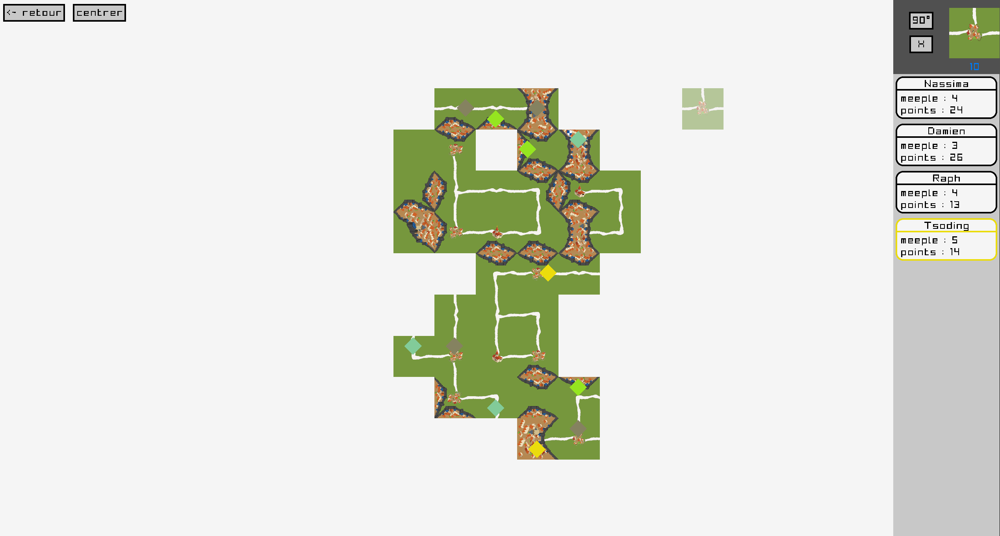

# Carcassonne en C

## Description

Jeux-vidéo Carcassonne pour GNU/Linux avec interface graphique avec [Raylib](https://github.com/raysan5/raylib).

## Compilation

Clonez la repo : 
```bash
$ git clone https://github.com/RaphaelMuzeau/Projet-Carcassonne-C.git
```

Assurez-vous d'être dans le dossier courant de la repo.

```bash
$ make run
```

Pour plus d'information : 

 ```bash
 $ make help
Commandes disponibles:
  all     - Lancer toutes les cibles (release, debug, test)
  release - Compiler avec optimisation
  debug   - Compiler avec symboles de debugage
  test    - Compiler et lancer les tests unitaires
  run     - Executer le programme (compile debug si besoin)
  runvg   - Executer le programme en version debug avec valgrind
  clean   - Supprimer les artefacts de compilation et les executables
  bear    - Generer compile_commands.json (nécessite bear)
  tar     - Archive la repo dans un tar avec compression gzip
  help    - Afficher ce message d'aide
```

---
