# Rapport d'analyse

### Analyse des besoins

Développement d'un jeu "Carcassonne" interactif avec interface graphique pour GNU/Linux en utilisant le langage C ainsi qu'une librairie graphique.
La phase de développement est comprise entre le 22 janvier et le 9 avril 2026 avec une équipe composée de trois personne : 

[MUZEAU Raphaël](https://github.com/RaphaelMuzeau) contact: raphael.muzeau@etudiant.univ-perp.fr<br>
[DANNA--VASSEUR Lucas](https://github.com/DannVass-Lucas) contact: lucas.danna--vasse@etudiant.univ-perp.fr <br>
[CORTALE--BECKER Tom](https://github.com/CrtlTom) contact: tom.cortale-beck@etudiant.univ-perp.fr<br>

---

## Spécifications

- Règles principales (***sans extensions***) du jeux de plateau Carcassonne.
- Un nombre fini de tuiles placées au cours d'une partie.
- Import d'un "jeu" de tuiles au format .csv fourni.
- Géneration aléatoire de tuiles possible.
- Sauvegarde et recharge d'une partie en cours.
- Une interface graphique.

### *Règles du jeu :*

Le Carcassonne est un jeu pouvant être joué de 2 à 5 joueurs. Celui-ci est composé de 72 tuiles (dans sa version d'origine) constituées de differentes zones :

- Route
- Ville
- Abbaye

Chaque joueur possède 7 meeple d'une couleur différente (rouge, jaune, noir, vert, bleu...). Ces meeple servent aux joueurs à s'attribuer une zone.  <br>
Lorsqu'une zone est complétée, ce joueur recevra des points en conséquence et pourra récuperer son meeple.


#### Déroulement :
À chaque tour,
1. Un joueur pioche une tuile sur la pile et la pose de manière à prolonger le paysage formé par les tuiles déjà présentes.
	> Si la tuile ne peut pas être placée, le joueur peut passer son tour, cette tuile ne sera pas réutilisée.
2. Ce joueur peut alors decider ou non de poser un **unique** meeple sur une des zones de cette tuile pour se l'attribuer.
3. Les points gagnés sont évalués.

Le jeu se termine lorsque la pile de tuiles est vide.

Étudions chaque zone une à une, du placement de la première tuile de ladite zone à la validation de la zone, lorsque la dernière tuile sera posée pour la compléter.

- ### La route :

Une fois une tuile avec une zone "route" posée, le joueur peut décider d'y poser un meeple pour s'attribuer la route. Un joueur peut poser un meeple sur une route si, et seulement si, aucun autre meeple ne s'y trouve.

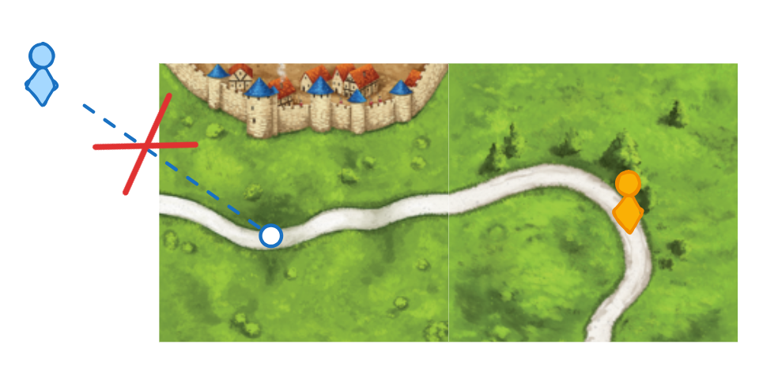

Cependant, il est possible que deux joueurs possèdent une même route, comme dans l'exemple ci-contre : 

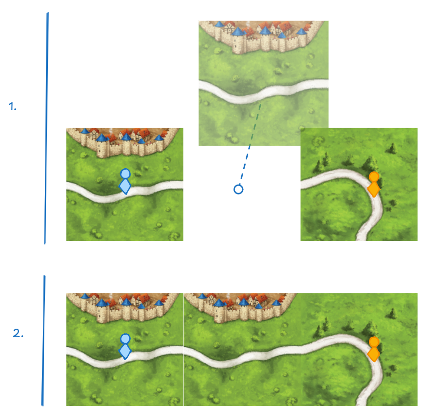

Ce cas ne peut arriver que lorsque deux routes séparées à l'origine se joignent. Dans ce cas, les deux joueurs se sont bien **attribués** la route quand ils étaient seuls, ce qui respecte la règle d'origine. Cette règle vaut pour toutes les *zones*.

Une *route* est considérée comme terminée lorsque le point de départ d'une route (ville, abbaye ou décoration) rencontre un autre point de départ (ici, considéré comme la "fin" de la route). Autrement dit, qu'aucun chemin de la route ne mène à une tuile vide.

Une fois une route terminée, le joueur ayant placé le plus de meeple dessus gagne **1 point** par tuile traversée par la route. Si plusieurs joueurs ont posé le même nombre de meeple, il gagnent tous l'intégralité des points. Si aucun meeple n'a été placé sur la route, aucun point n'est accordé.

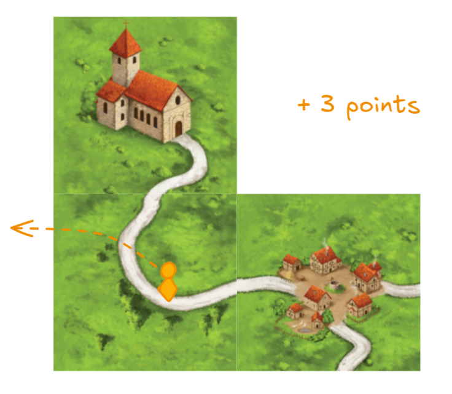

- ### La ville :

Une fois une tuile avec une zone "ville" posée, le joueur peut décider d'y poser un meeple pour s'attribuer la ville. La règle reste la même que pour la route, aucun autre meeple ne doit y être déja présent.

Une *ville* n'est considérée comme terminée que lorsque l'intérieur de la ville est entourée de "muraille" (ville aux abord d'un pré) sans aucun "trou". 

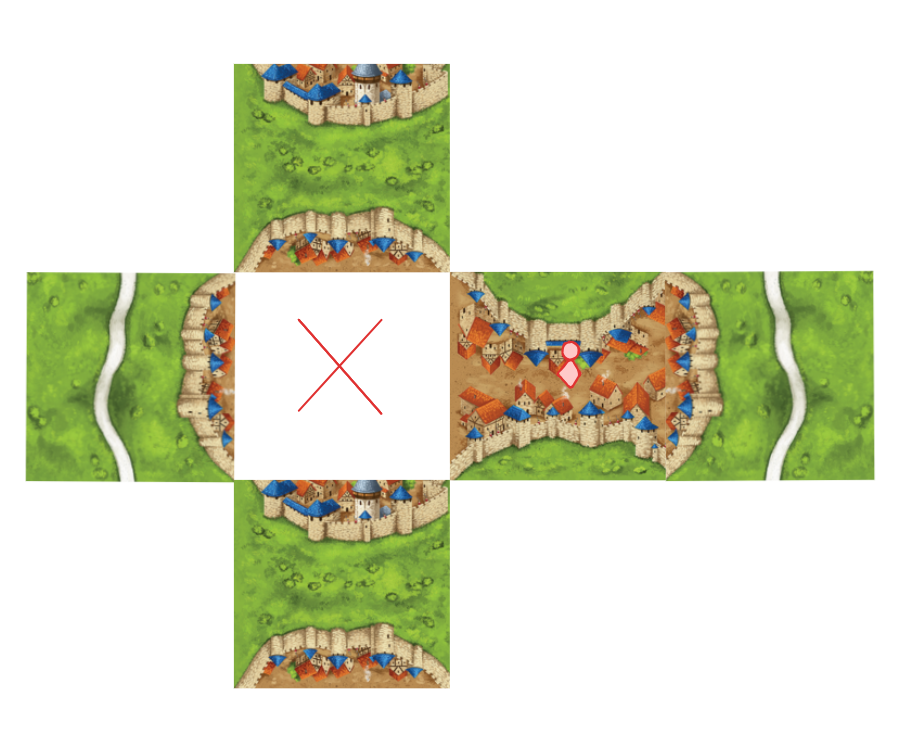<br>
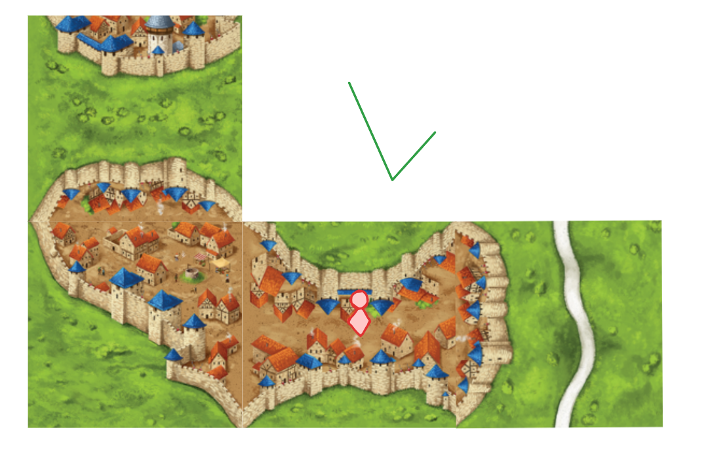

Ici, durant la partie en cours, chaque tuile vaut **2 points** mais, si celle-ci est estampillée d'un ***blason***, alors vous gagnez **2 points** en plus sur la tuile constituant la ville.

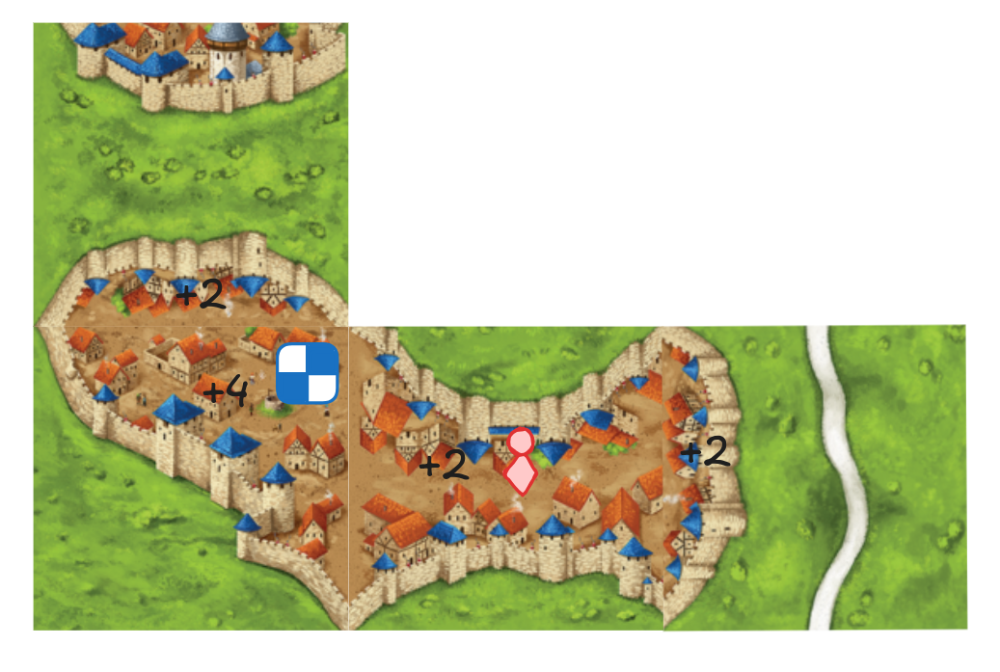

- ### L'abbaye :

Les tuiles *abbaye* sont toujours représentées par une abbaye à leur centre. Ici, pour compléter une zone, il vous faut l'entourer de huit autres tuiles avec l'abbaye en son centre, comme sous l'image ci-dessous : 

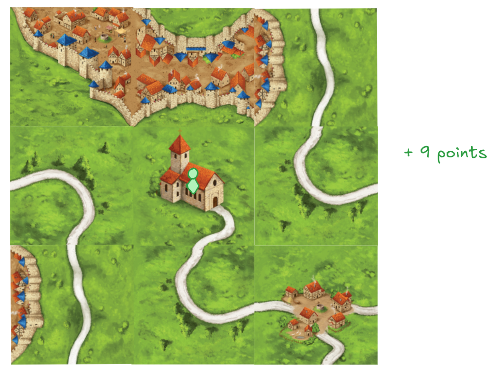

Durant la partie en cours, une zone rapporte un point par tuile, l'abbaye incluse. Une zone complète vous rapporte alors **9 points**.

Une fois n'importe quelle zone complétée, les joueurs peuvent alors récupérer leurs meeple, sinon, ceux-ci restent à leur position jusqu'à la fin de la partie.

### En fin de partie :

Lors d'une fin de partie, certaines zones ne sont pas complétées. La délibération des points sera ainsi faite : 

- Chaque tuile traversé par une route incomplète rapporte **1 point**
- Chaque tuile traversé par une ville incomplète rapporte **1 point** et **1 point** de plus si la tuile possède un blason.
- Chaque abbaye rapporte **1 point** et **1 point** par tuile adjacente.

Le joueur avec le plus de points remporte la partie.

### *Interface Utilisateur :*

Toutes les intéractions avec le jeu se feront par le biais d'une interface graphique, en fenêtre flottante ou en plein écran.

Le joueur sera d'abord acceuilli par un écran titre simple :

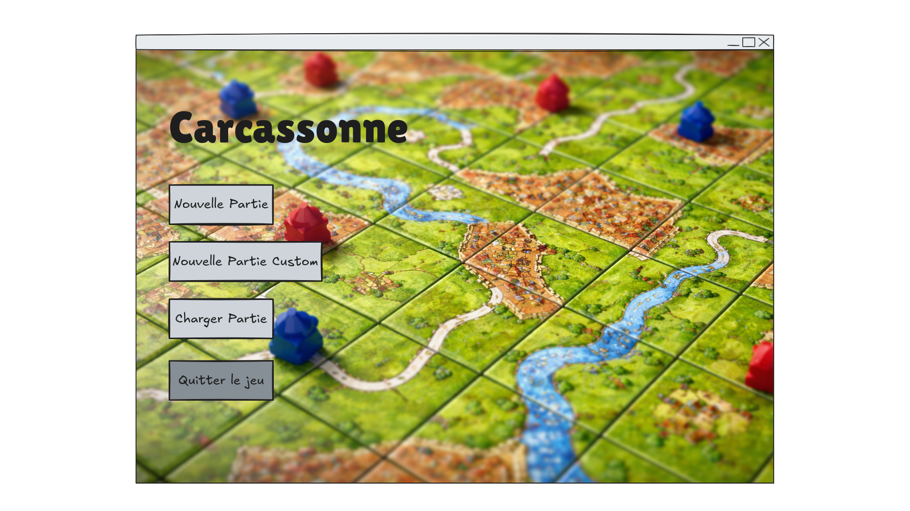

Une partie standard lance le jeu avec les règles standards de carcassonnes, 72 tuiles, 7 meeple par joueur.

L'interface principale du jeu se compose d'un unique écran décrit ci-dessous:

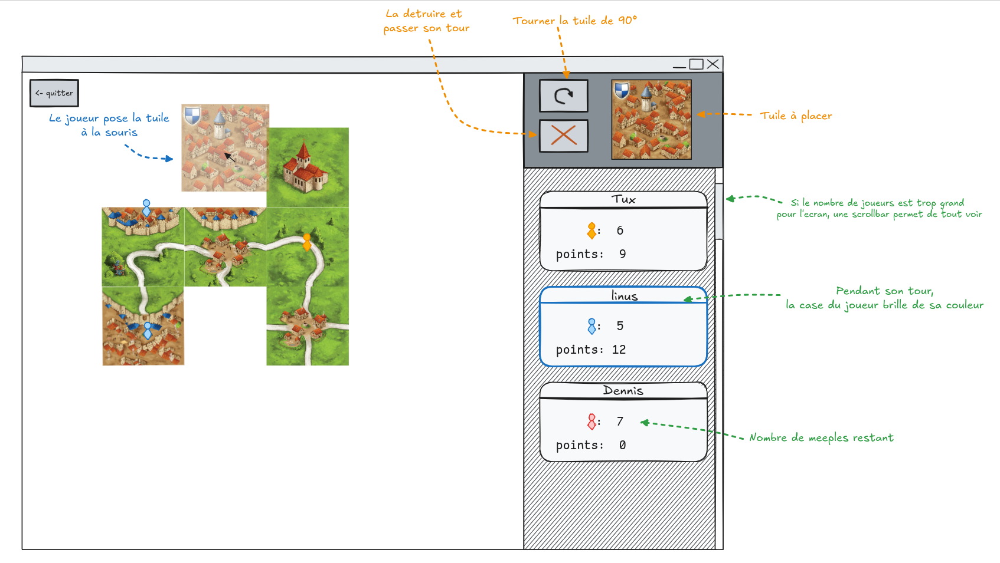

Le joueur peut librement déplacer la caméra sur le terrain de tuiles.

Si le joueur décide de quitter la partie, une pop-up lui propose de sauvegarder sa progression dans un fichier.

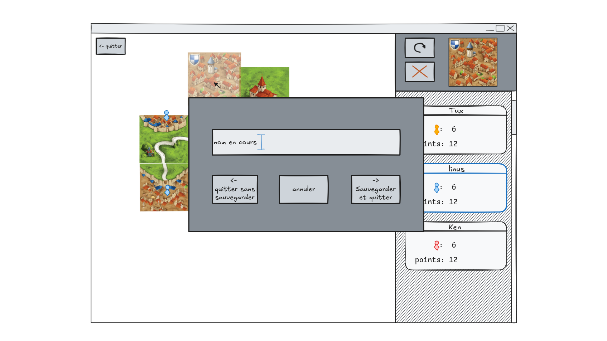

Au moment de lancer une partie custom, un écran de configuration permet de gérer les paramètres de la partie. Pour une partie standard, cet écran n'indique que le nombre de joueurs.

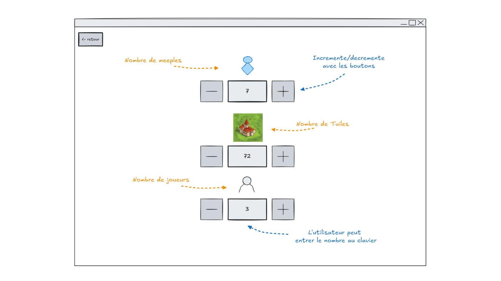

Pour charger une partie, le joueur ne peut que sélectionner parmis les fichiers disponibles.

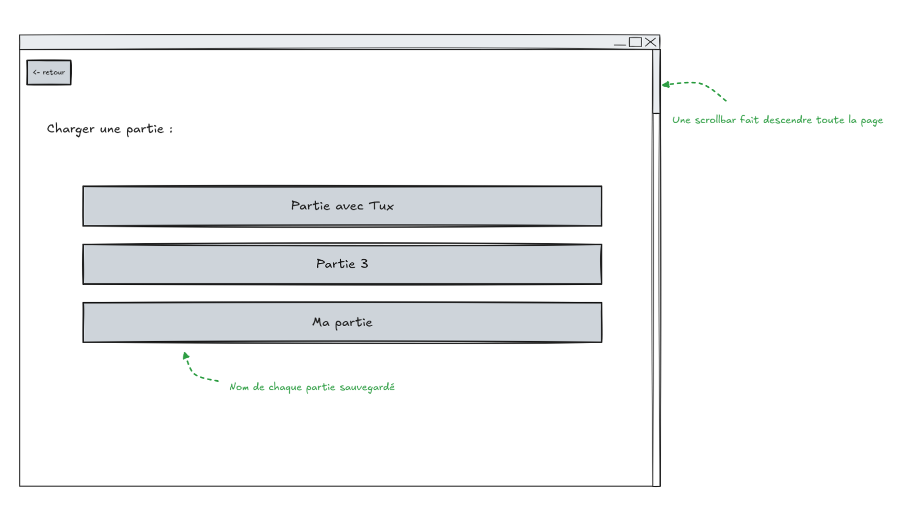

### *Format csv*

Les tuiles d'une partie peuvent êtres importées à l'aide d'un fichier un csv:
```csv
# côté 1, côté 2, côté 3, côté 4, centre
route,ville,route,pre,route
route,ville,pre,route,route
blason,blason,blason,route,blason
route,ville,pre,route,route
route,ville,ville,route,route
```

Chaque entrée spécifie les zones présentes à chaque coté de la tuile et en son centre, écrite en toute lettre *(route, ville, blason, pre, village, abbaye)*. Une abbaye ou un village ne peuvent apparaîtres qu'au centre d'une tuile.

Ces fichiers csv seront listés avec les parties chargeable comme une partie standard dont la pile de tuile sera prédefinie.

Ces fichiers ne précisent pas l'ordre de *tirage* des tuiles, qui reste aléatoire, la pile est "mélangée" même si elle est chargée à partir d'une fichier.

---

## Conception Architecturale

### Modèle MVC :

- **Modèle**  -- génère et contient le terrain du jeu, la pile de tuile, les meeple placés, les joueurs et leurs données.
- **Vue** -- affiche l'état du modèle en temps réel et reçoit les entrées utilisateur.
- **Contrôleur** -- recoit les entrées de la vue et modifie le modèle en conséquence. (ex : positionnement d'une tuile à certaines coordonées, calcul des points, placement et retrait des meeple...).

### Arborescence :

```
.
├── bin
├── data
│   ├── parties
│   └── assets  // données requisent par l'interface graphique
│   └── test    // fichiers utilisés par les tests unitaires
├── include
├── lib
├── obj
└── src
    ├── model
    ├── view
    └── controller
```

Seuls les fichiers présents dans `data/parties` seront présentés au joueur.

#### Dépendances :

Utilisation de la librairie [Raylib](https://github.com/raysan5/raylib) pour l'interface utilisateur.
