# Rapport d'implémentation

[MUZEAU Raphaël](https://github.com/RaphaelMuzeau) contact: raphael.muzeau@etudiant.univ-perp.fr<br>
[DANNA--VASSEUR Lucas](https://github.com/DannVass-Lucas) contact: lucas.danna--vasse@etudiant.univ-perp.fr <br>
[CORTALE--BECKER Tom](https://github.com/CrtlTom) contact: tom.cortale-beck@etudiant.univ-perp.fr<br>

---

Le rapport d'implémentation sera découpé en sous-chapitres qui représentent chaque structure de données. Chaque structure présentera aussi les fonctions avec lesquelles elle intéragit.  
Les fonctions qui ne seront pas détaillées sont considérées comme assez simples pour lire le code source. Les autres auront des détails apporté dans ce même rapport.

## Tuiles : 

Le premier élément sur lequelle nous allons nous concentrer est la tuile, pouvant être retrouvés dans`tuile.h` et ses fonctions dans  `tuile.c`.  
  
 La première chose à laquelle nous avons dû penser est la représentation des zones et leurs valeurs. Il a donc été décidé, après quelques réflexions, que la structure la plus correcte serait la suivante : 
 
 ``` C
enum Zone {
	Z_PRE     = 0x01, // 0b000001
	Z_ROUTE   = 0x02, // 0b000010
	Z_VILLE   = 0x04, // 0b000100
	Z_BLASON  = 0x0c, // 0b001100
	Z_VILLAGE = 0x10, // 0b010000
	Z_ABBAYE  = 0x20, // 0b100000
};
```


Il est à noté qu'il y a un bit en commun entre `Z_VILLE` et `Z_BLASON` pour que les deux puissent être considérées égaux via l'opération `&` ("et binaire") en C. <br>

Vient ensuite l'implémentation de la tuile, elle-même. Nous avons donc eu à réfléchir aux informations dont nous avions besoins dans une tuile : 

- Nos zones (milieu, nord, sud, est, ouest),
- Un id meeple pour savoir si un meeple est posé sur la tuile,
- La position du meeple,
- Savoir si on a vérifié notre tuile lors de la recherche,


```C
struct _Tuile {
	enum Zone milieu, nord, sud, est, ouest;
	int id_meeple;
	enum Direction position_meeple;
	bool est_verifie;
};
typedef struct _Tuile *Tuile;
```

Il est à noter que le type `Tuile` est un **pointeur**. La variable `id_meeple` aura une valeur supérieure à 0 si un meeple est posé dessus, -1 s'il n'y a aucun meeple sur la tuile. Il est importante de re-préciser qu'il ne peut y avoir qu'**un seul meeple** par tuile. Le booléen `est_verifie` variera entre false et true selon l'état dans recherche.<br>
Il nous faut aussi un moyen de connaître la position de notre meeple, nous avons donc créer une dernière structure utile au repérage du meeple sur la tuile : 

```C
enum Direction {
    D_SUD = 0,
    D_NORD,
    D_EST,
    D_OUEST,
    D_MILIEU,
};
```

Cette structure aura aussi d'autres utilitées dans la *recherche*.

Notre tuile ainsi définie intéragit avec différentes fonctions, en voici une liste exhautive (via leurs signatures) qui peut être retrouvée dans `tuile.h` :

- ***`Tuile creer_tuile(void)` ***
- ***`void pivot_90(Tuile piece)`***
- ***`enum Zone zone_tuile(Tuile t, enum Direction d)`***
- ***`bool compatibilite_tuile(Tuile depart, Tuile arrivee, enum Direction d)`***
- ***`Tuile generer_tuile(void)`***

### Schéma de la tuile :
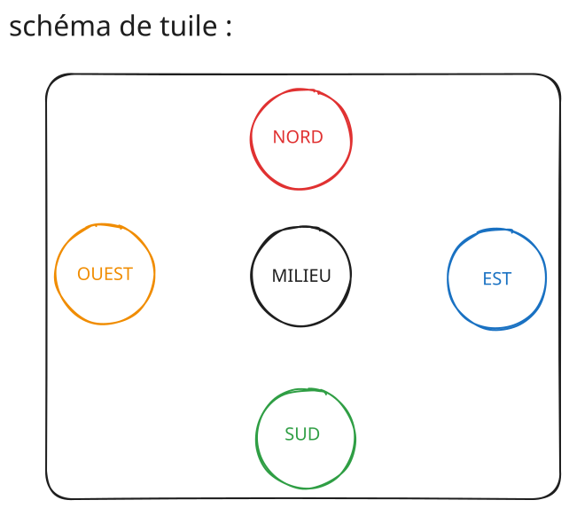

#### Précisions sur certaines fonctions :

La fonction ***`creer_tuile`*** renvoie une tuile initialisée comme un pre (chaque zone à la valeur d'un pré), l'`id_meeple` sera à -1, la direction du meeple sera 0 (D_SUD) et le booléen à false (0);

La fonction ***`pivot_90`***, réalise le pivot sur la droite.

La fonction ***`zone_tuile`*** nous renvoie la valeur d'une zone de la tuile selon une direction donnée.

La fonction ***`compatibilite_tuile`*** nous renvoie un booléen qui nous dit si deux tuiles sont compatibles entre elles.

La fonction ***`generer_tuile`*** sert à générer une tuile (respectant les règles du jeu) de façon aléatoire.

#### Générer tuiles : 

La génération aléatoire est une des demandes à respecter ajouté à l'analyse du projet. Pour pouvoir la réaliser nous avons étuider longuement la construction des tuiles du `.csv` et avons ajouté quelques règles pour créer des tuiles dites "valides" dans notre version de Carcassonne. <br> 
Une règle implicite que nous ajoutons au jeu est le fait que si une zone "route" ou "ville" apparaît au milieu, alors celle-ci fait le lien entre deux autres zones, comme sous cet exemple : 

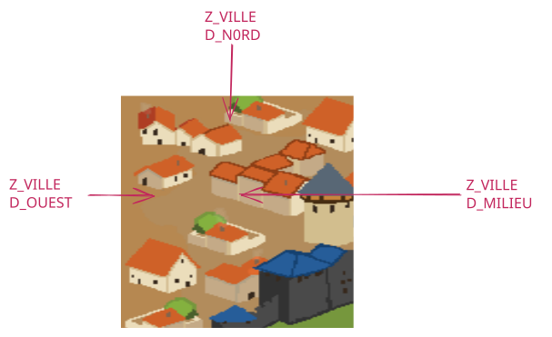

Nous autorisons aussi la génération de tuiles qui n'existent pas dans le Carcassonne d'origine, comme celles-ci, par exemple : 

 
 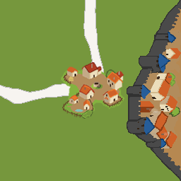
 
Pour encore plus de fun !

Les probabilités pour la génération des tuiles ont été calculées via un script R se basant sur le `.csv` fourni pour la réalisation du projet, en voici les diagrammes en barres : 

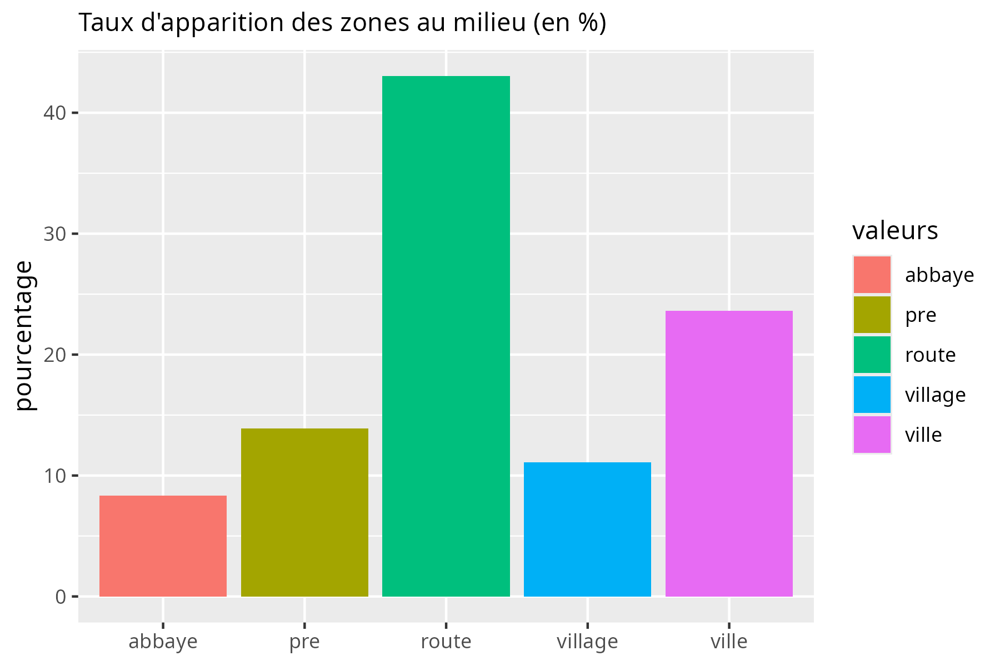
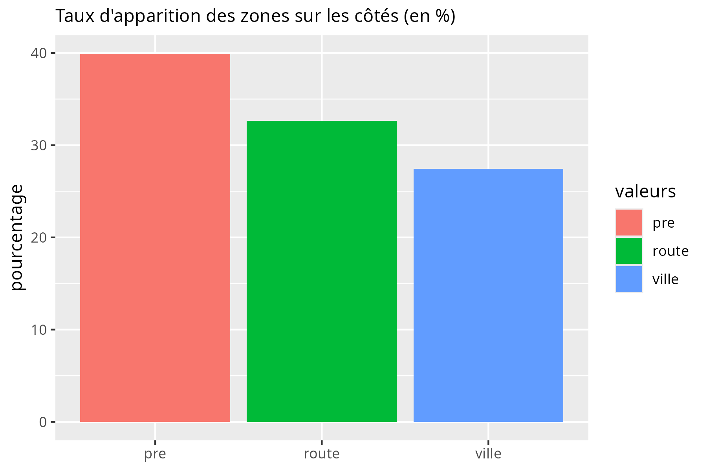


## Meeple :

Le meeple n'est pas une structure en elle-même dans notre implémentation. Nous avons réfléchis à son utilisation et nous nous sommes rendus compte que le meeple n'avait pas besoin d'une structure en dédiée. Par contre, nous devions avoir un endroit qui nous nous sert à connaître en permanence les positions des meeple.

Nous avons donc eu l'idée d'une liste chaînée de meeple, qui nous sert à n'importe quelle moment à savoir où se trouve les meeple.

Voici la structure implémentée : 

```C
struct _Maillon {
    struct _Maillon *next;
    int x;
    int y;
};
typedef struct _Maillon *L_meeple;
```

S'accompagnant de toutes les fonctions classiques d'une liste chaînée :

- `L_meeple creer_maillon_meeple(int x, int y, enum Direction d)`
- `void detruire_liste_meeple(L_meeple liste)`
- `void ajouter_maillon_meeple(L_meeple *liste, L_meeple nouveau)`
- `void retirer_maillon_meeple(L_meeple *liste, int x, int y)`

## Pile :

Il nous fallait aussi implémenter une pile de tuiles, dans laquelle nous pourrions ranger les tuiles d'un `.csv` ou même compter les tuiles restant aux joueurs. En respectant les deux implémentations possibles donnée dans l'analyse. La structure finale nous a donnée ceci : 
```C
typedef struct _Pile {
    Tuile *tab;
    bool gen_aleatoire;
    int nb_element, nb_element_max;
} Pile;
```

Avec les fonctions suivantes : 

- ***`Pile creer_pile(int max_element, bool gen)`***
- ***`bool pile_vide(Pile p)`***
- ***`bool pile_pleine(Pile p)`***
- ***`Tuile recup_tuile(Pile *p)`***
- ***`bool inserer_tuile(Pile *p, Tuile t)`***
- ***`void detruire_pile(Pile *p)`***

### Schéma de la pile :
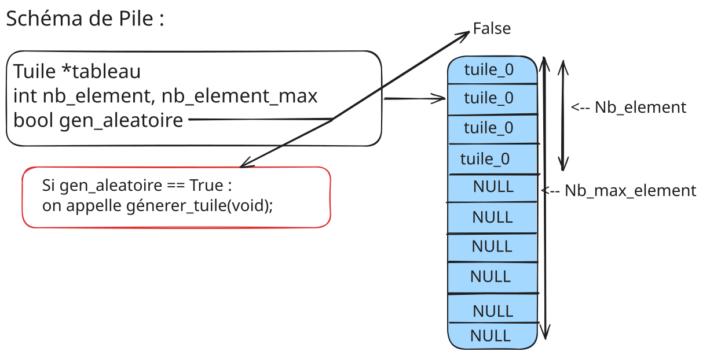

#### Précisions sur certaines fonctions :

La fonction ***`recup_tuile`*** quand *`gen_aleatoire`* vaut `false`, récupère une tuile au hasard comprise entre [0, nb_element-1]. Une fois la tuile récupérée, son emplacement est de nouveau remplie avec la dernière tuile se trouvant dans la pile. <br>
Si *`gen_aleatoire`* vaut `false`, ***`recup_tuile`***  appellera la fonction ***`generer_tuile`*** .

La fonction ***`bool inserer_tuile`*** est une fonction qui nous servira seulement lors de la lecture de `.csv`. Elle insère une `Tuile` dans le tableau de la pile.

## Plateau :

La question de la représentation du tableau était restée longtemps un sujet d'étude. Plusieurs suggestions ont été proposées et ont vu le jour, comme : 

- Tableau 2D statique : <br>
    Avantage, simple, pratique.   
    Désavantages : Coûteux en mémoire.
    
 - Listes n-chaînées : <br>
	Avantage : Réduction du coup mémoire  
	Désavantage : Complexité d'utilisation liée à la recherche, enchaînements implicites (localisation compliqué lors de l'enchaînement)

Nous étions à l'origine parti sur un simple tableau 2D statique, dont la taille restait personnalisable. Mais lors de l'implémentation de la structure de `Varstring`, une idée a émergée.  
Celle du **`Vec2D`**. L'idée était simple mais excessivement efficace. Le coût mémoire était grandement réduit, et nous gardions la simplicité d'accessibilité d'un tableau via des fonctions très simple d'accès.

Le vec2D repose sur deux structures presque identiques. La première : 
```C
typedef struct _Vec {
    Tuile *_tableau;
    int _capacite; // nombre de tuiles pouvant être contenues
    int _decy;
} Vec;
```

 Cette structure `Vec` est celle qui contiendra les `Tuiles`, la variable *decy* nous est utile pour pouvoir indexer avec des valeurs négatives. Si une tuile est posé en *-1* sur le plateau, le décalage augmente de 1, pour que lors de l'indexation sur *`_tableau`, la valeur soit tout de même comprise entre [0, *`_capacite`*].
 
 Voici un schéma visuel de ce que fait la structure : <br>
 
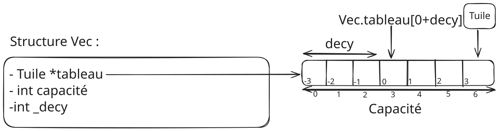

Cette structure sert donc à gérer les *colonnes* de notre plateau, ne reste plus qu'à gérer les *lignes*. C'est là qu'intervient notre 2nd structure : 

```C
typedef struct _Vec2D {
    Vec *_tableau;
    int _capacite;
    int _decx;
} Vec2D;
```


Le principe y est le même, notre tableau indexe ici des *`Vec`*, mais tout le reste fonctionne de la même manière. 
  
  
Accompagné de son schéma : 

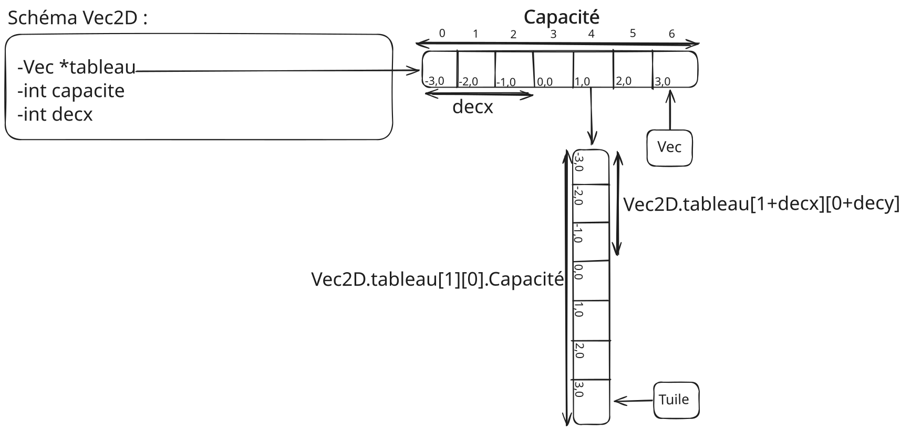

<br>

Liste exhaustive des fonctions : 

- ***`Vec2D creer_vec2D(void)`***
- ***`void detruire_vec2D(Vec2D g)`***
- ***`Tuile get(Vec2D g, int x, int y)`***
- ***`void set(Vec2D *g, Tuile t, int x, int y)`***

#### Précisions sur certaines fonctions :

La fonction ***`creer_vec2D`*** initialise notre vecteur avec toutes ses valeurs à 0 (zéro).

La fonction ***`get`*** sert à récupérer une tuile sur la grille aux coordonnées du plateau [INT_MIN, INT_MAX], elle renvoie la tuile si elle est trouvée, et renvoie *NULL* sinon.

La fonction ***`set`*** pose la tuile aux coordonées passées en argument.

## Joueurs :

Vient ensuite, la représentation de nos joueurs, ici encore, une réflexion rapide nous à apporter toutes les informations que nous **voulions** dans notre strucutre, ce qui nous a donné le code suivant : 

```C
typedef struct _Joueur {
    char *nom;
    int id;
    int pts;
    int nb_meeple_restant;
    L_meeple localisation_meeple;
	Color couleur;
} Joueur;
```

La structure `L_meeple` (localisation meeple) enregistre tous les meeple placés par le joueur sur le grille ainsi que leur position.

Liste exhaustive des fonctions : 

- ***`Joueur creer_joueur(int id, int nb_meeple)`***
- ***`void detruire_joueur(Joueur joueur)`***
- ***`ListeJoueurs creer_listejoueurs(int nb_joueurs, int nb_meeple)`***
- ***`void detruire_listejoueurs(ListeJoueurs joueurs)`***


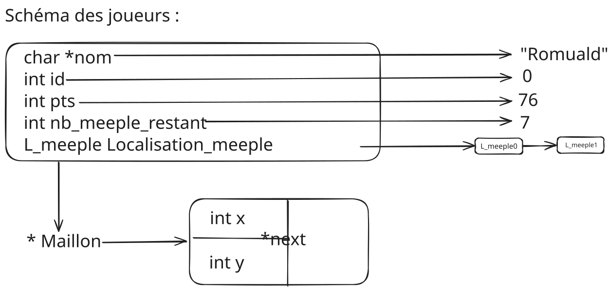


Il nous fallait un endroit où réunir tous nos joueurs, donc nous avons créer un tableau où se trouvent tous nos joueurs : 

```C
typedef struct _ListeJoueurs {
    int nb_joueurs;
    Joueur *tableau;
} ListeJoueurs;
```


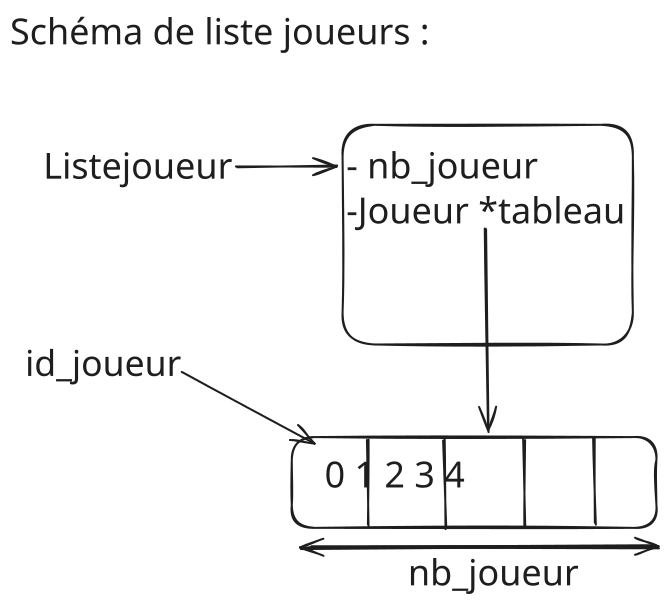


## Algorithmique :


## Jeu :

Cette algorithme s'exécute lorsqu'une procédure de recherche est engagée. Exemple : Lors d'un placement de tuile. Cette fonction permet de renvoyer les points que nous allons pouvoir attribuer par la suit, la recherche effectue également l'analyse du nombre de meeple présents dans un tableau indexé par l'id des joueurs sur la zone recherchée et sauvegarde leurs localisations dans *loc_meeple_all*, une liste chaînée contenant tous les meeples trouvés. <br>
La recherche s'arrête quand on arrive sur une tuile déjà vérifiée ou une tuile vide.

Cette fonction est récusrive, elle sera appelée sur chaque case de notre recherche.

Il y a un booléen présent dans la recherchen nommé *complete*, définit sur *true*, il peut changer de valeur dans le cas où `recherche_suite` renverait *-1* dans la valeur *tmp*.

Si `recherche` réussie, elle renvoie le nombre de points, si la zone est complétée. Sinon, elle renvoie -1.


La fonction appelée dans `recherche`, `recherche_suite` est une encapsulation qui permet une meilleur lisibilité du code dans son ensemble. Pour autant elle marche de pair avec `recherche`, en voici le codde : 


Cette fonction consiste simplement à analyser la présence d'un meeple sur une tuile et l'ajouter à *loc_meeple* et appelle de manière récusrive la `recherche` sur les différentes directions qui composent la tuile aux zones compatibles avec celle de la recherche.

Liste des fonctions : 

- ***`Jeu creer_jeu(int nb_joueurs, int nb_meeple, int nb_tuiles)`***
- ***`void detruire_jeu(Jeu jeu)`***
- ***`void attribution_points(Jeu *jeu, L_meeple loc_meeple, int *nb_meeples, int pts)`***
- ***`bool tour(Jeu *jeu, Tuile tuile, int x, int y, int id_meeple, enum Direction position_meeple)`***
- ***`void fin(Jeu *jeu)`***

#### Précisions sur les fonctions :

La fonction ***`attribution_points`*** n'est appelée qu'après une recherche. Elle va aussi attribuer les points au joueur ayant le plus de meeple.

La fonction ***`tour`*** gère touts les actions réalisées par un joueur durant un tour, pour être plus précis : placement de la tuile, du meeple éventuel, de la recherche, et de l'attribution des points. Tour vérifie aussi la présence d'abbaye à proximité et va attribuer les points si nécessaire.

La fonction ***`fin`*** aura un comportement similaire, mais celle-ci va lancer une recherche à la position de chaque meeple, attribue les points et annonce le gagnant de la partie.

## Fichiers :

### CSV :
 
 La priorité était d'implémenter une façon de lire un fichier `.csv`. Nous partons du principe que le fichier est correct.
 Une seule information importante est à noter : la dernière valeur de chaque ligne du `.csv` représente la valeur de son milieu. Nous pouvons l'analyse facilement grâce aux valeurs `villages` et `abbaye` qui n'apparaissent qu'au milieu.   
Avec la commande `cat tuiles.csv | grep abbaye && cat tuiles.csv | grep village`
 
 ```csv
 pre,pre,pre,pre,abbaye
pre,pre,pre,route,abbaye
pre,pre,pre,pre,abbaye
pre,pre,pre,pre,abbaye
pre,pre,pre,pre,abbaye
pre,pre,pre,route,abbaye
pre,route,route,route,village
route,route,pre,route,village
route,route,ville,route,village
route,route,pre,route,village
pre,route,route,route,village
route,route,ville,route,village
route,route,ville,route,village
route,route,route,route,village
 ```
 
 Ainsi nous aurons trois fonctions principales : 
 
 - `int compter_lignes(FILE *f)`
 - `bool lire_zone(enum Zone *p, FILE *f)`
 - `Pile lire_tuiles_csv(char* nom_fichier)`

#### Précisions sur certaines fonctions : 

***`compter_lignes`*** nous sert à compter le nombre de lignes (et ainsi de tuiles) présentent dans le fichier `.csv`. Elle nous sert pour savoir combien de tuiles seront lues par ***`lire_tuiles_csv`***.

***`lire_zone`*** va lire une zone (une valeur du csv) et l'ajouter à une zone de la tuile de façon indépendante. 

***`lire_tuile`*** renvoie une pile qui sera remplie par les tuiles lues dans le fichier `.csv` passé en argument.

##### Notes : Il faut bien faire attention à récupérer la valeur de fread pour éviter une erreur du compilateur avec l'option -Wall.

### Sauvegarder et charger :

Une des fonctionnalités importantes que nous souhaitions importer était la possibilité pour le joueur de sauvegarder et charger des parties. Notre choix a été de sauvegarder les parties sous format binaire pour diminuer leur taille.

La première question à laquelle nous devions répondre était, "Que doit-on enregistrer ?". Après une analyse des besoins pour reprendre une partie dans les meilleures conditions. Voici ce dont nous avions besoin pour d'enregistrer lors d'une sauvegarde  :

+ L'état de la pile.
+ L'état des joueurs 
+ L'état du plateau avec les tuiles.


Pour répondre à ses besoins, plusieurs fonctions ont été introduites : 

- ***`void sauvegarder_grille(Vec2D g, FILE *f)`***
- ***`void sauvegarder_pile(Pile p, FILE *f)`***
- ***`void sauvegarder_liste_joueurs(ListeJoueurs tab, FILE *f)`***
- ***`void sauvegarder_joueur(Joueur joueur, FILE *f)`***

Ainsi qu'une fonction qui les encapsule toutes dans l'ordre ci-dessus : ***`bool sauvegarder_partie(Jeu partie, char *fname)`*** pour sauvegarder une partie complète. 

#### Précisions sur certaines fonctions :

La fonction ***`sauvegarder_partie`*** prend le nom d'un fichier via la variable *fname* et ouvre le fichier (via un pointeur) qui sera ensuite passé à chaque sous-fonctions. Elle précise un numéro de version (devant être changé à chaque modification d'une fonction "sauvegarder").

*Conseil :* La commande `strings` sur un fichier binaire de partie permet de savoir facilement la version dudit fichier (binaire) que vous ciblez. En cas de doute, vous pourrez ainsi vous en assurez visuellement, mais la fonction `charger_partie` s'occupe déjà de vérifier la version. <br>

De pair, nous retrouvons les mêmes fonctions pour charger une partie : 

- ***`Vec2D charger_grille(FILE *f)`***
- ***`Pile charger_pile(FILE *f)`***
- ***`ListeJoueurs charger_liste_joueurs(FILE *f)`***
- ***`Joueur charger_joueur(FILE *f)`***

Une fonction encapsulante existe aussi pour charger la partie, toujours dans l'ordre ci-dessus : ***`bool charger_partie(Jeu *partie, char *fname)`***.

#### Précisions sur certaines fonctions :

La fonction ***`charger_partie`*** prend elle aussi le nom d'un fichier via une variable *fname* ouvrira le fichier et passera un pointeur aux autres fonctions. Elle vérifie le numéro de version et poursuit sur le chargement individuel de chaque structure. Si un fichier est incorrecte, le programme sera arrêté.


Ci-dessous, peut être retrouvé un schéma représentant l'agencement des données dans un fichier complet :

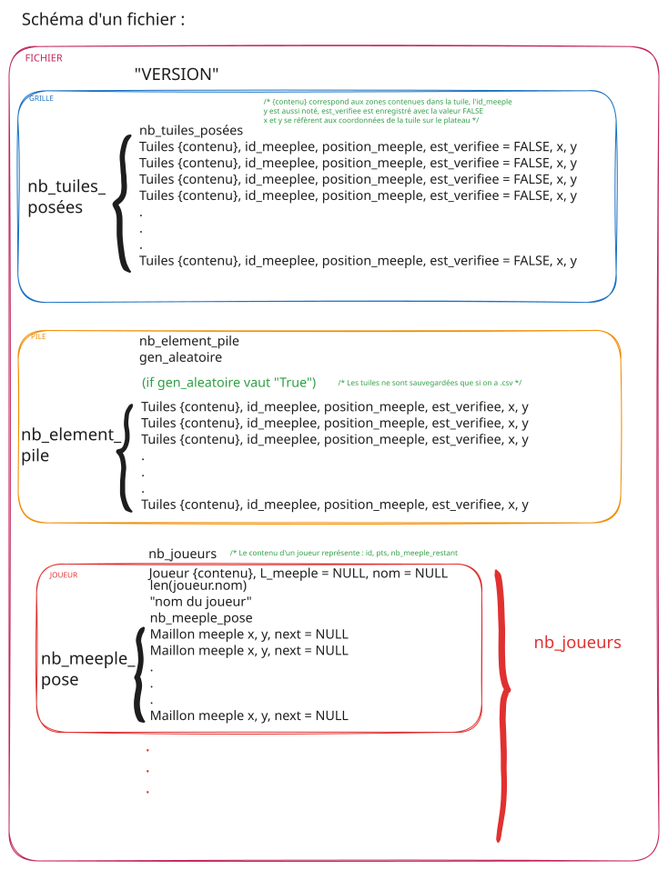

Ce schéma est simplifié pour la vision humaine, souvenez-vous que ce ne sont que des bits qui y sont normalement écrits, l'ordre choisit pour représenter le sein de chaque donnée est arbitraire. L'ordre des structures lui respecte l'implémentation actuelle. <br>
Des commentaires pertinents sont aussi annotés sur le schéma, tenez en rigueur en cas de questions.

# Implémentation graphique :

Nous utilisons la librairie graphique [Raylib](https://github.com/raysan5/raylib) via un précompilé `.a` pour créer et gérer toute l'interface graphique.

Nous nous servons du `main.c` pour naviguer entre différentes pages. Ces pages sont "en réalité" différents fichiers qui gèrent l'affichage d'une fenêtre (avec leus propres comportement dans leurs propres header).

Voici les différentes pages : 

- Page titre
- Page jeu
- page conf
- page charger
- page gagnant

Chaque page est gérée indépendament mais certaines fonctionnalités restent récurrentes. C'est pour cela que nous les gérons comme des "widgets" (éléments interactifs) généraux, qui possèdent leurs propres fichiers. Par exemple, les boutons sont considérés comme tels et peuvent être retrouvés dans `bouton.h`, voici une liste exhaustive des widgets existants sur le projet :

- ***bouton.h***
- ***champsaisie.h***
- ***scrollbar.h***
- ***sidebar.h***
  
Par exemple, la page de jeu qui est là où sont posées les tuiles et où la partie se déroule dans son ensemble se sert de la sidebar, de la scrollbar, du champs de saisie etc.
La page de configuration inclut des champs de saisies et la scrollbar.

Les champs de saisies sont gérées via VarString, une implémentation de chaine de texte pouvant être supprimée, caractère par caractère (touche retour), supprimer l'ensemble de la chaîne (suppr). Ajouter des cacractères.

La dernière partie graphique a détaillée est le fichier `render.h`. Ce fichier nous sert à allouer des `chunks`, un `chunk` est une texture, pouvant en contenir plusieurs (selon des tailles définies par des macros), ici, celles des tuiles. Cette méthode permet de gérer rapidement le dessins de la tuile et de préparer des zones allouées en amont pour les tuiles. 
Les textures des tuiles (sprites) sont générés aléatoirement via un algorithme se trouvant dans "dessiner_tuile", de façon à respecter la tuile générer aléatoirement, ou celle du `.csv`.

Toutes les textures sont mises en mémoire dans le GPU (VRAM) et permettent un rendu fluide.